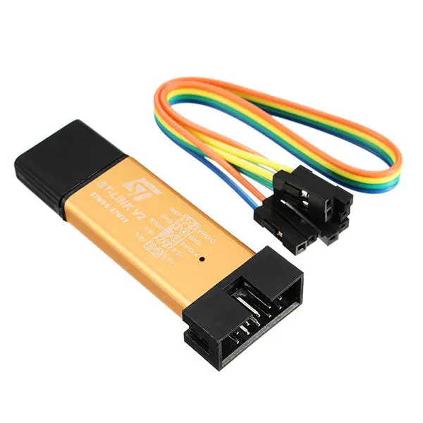
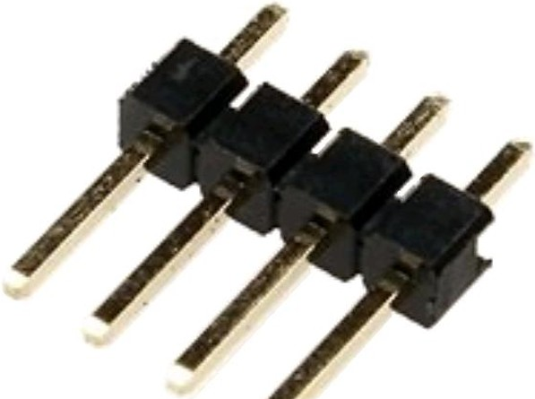
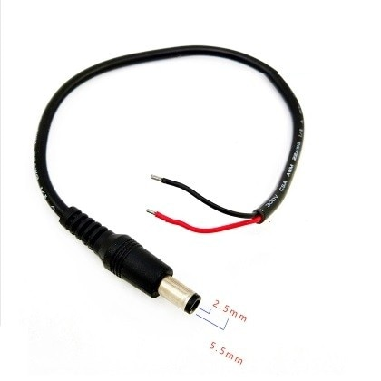
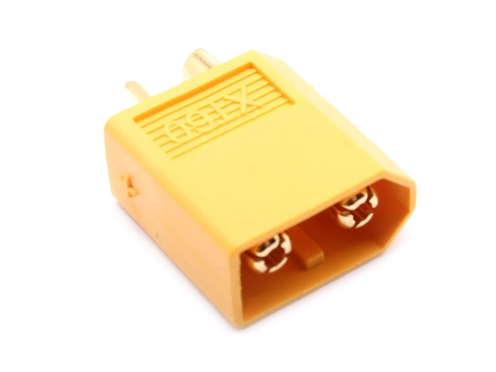
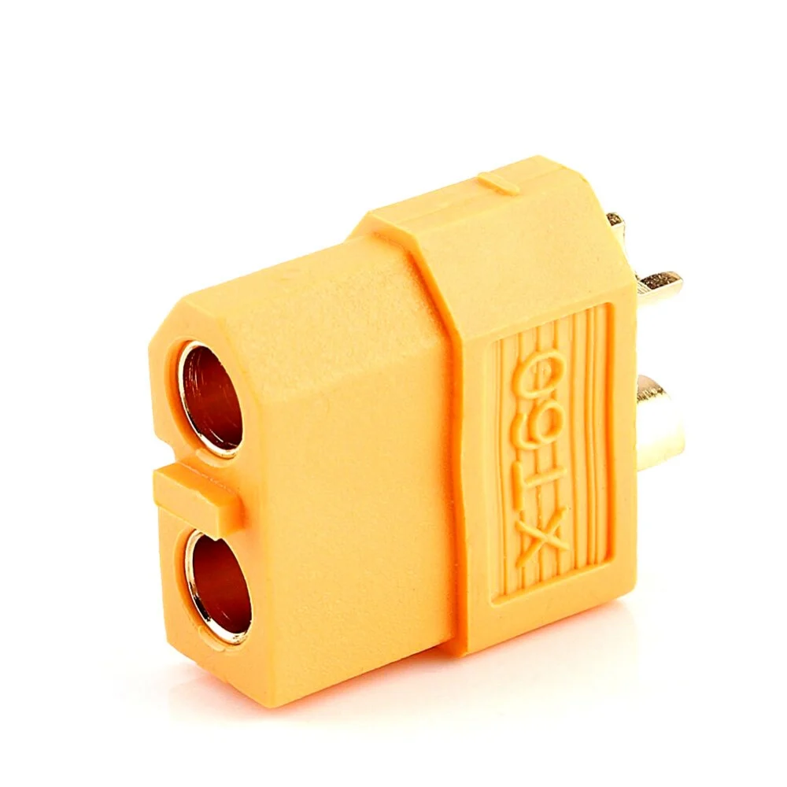

BOM:

|Деталь  | Кол-во | Примечание |
|----------------|:---------:|----------------:|
| Колесо 6.5'' | 2 | Есть в гироскутере |
| Крепежи колес | 2 | Есть в гироскутере |
| Контроллер гироскутера | 1 | Есть в гироскутере |
| Батарея гироскутера | 1 | Есть в гироскутере |
| Кнопка пуска | 1 | Есть в гироскутере |
| Разъем зарядки | 1 | Есть в гироскутере |
| ST-LINK адаптер| 1 |  |
| Вилка штыревая 2.54мм 1х4| 1 |  |
| Болт М8х40 | 8 |  |
| Гайка М8 | 8 |  |
| Шайба М8 | 8 |  |
| Винт М4х20 | 10 |  |
| Винт М4х40 | 4 |  |
| Гайка М4 | 14 |  |
| Шайба М4 | 12 |  |
| Шурупы | 6 |  |
| Фанера 4мм шлифованная | около 0,5 м2 |  |
| Клей ПВА | около 50 гр |  |
| Брус 40х40 | около 1м |  |
| Jetson Nano | 1 |  |
| DC-DC адаптер 40V-5V 3A| 1 |  |
| Разъем 5.2 мм| 1 |  |
| Разъем XT60 розетка | 2 |  |
| Разъем XT60 вилка | 1 |  |

Опционально :

|Деталь  | Кол-во | Примечание |
|----------------|:---------:|----------------:|
| Веб-камера | 1 |  |
| Лидар RPLidar A2 | 1 |  |

Кроме этого понадобится :
* Отвертка PH2
* Отвертка HEX6
* 3D принтер
* Паяльное оборудование - паяльник, олово, флюс
* Компьютер
