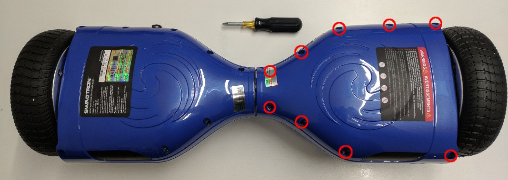
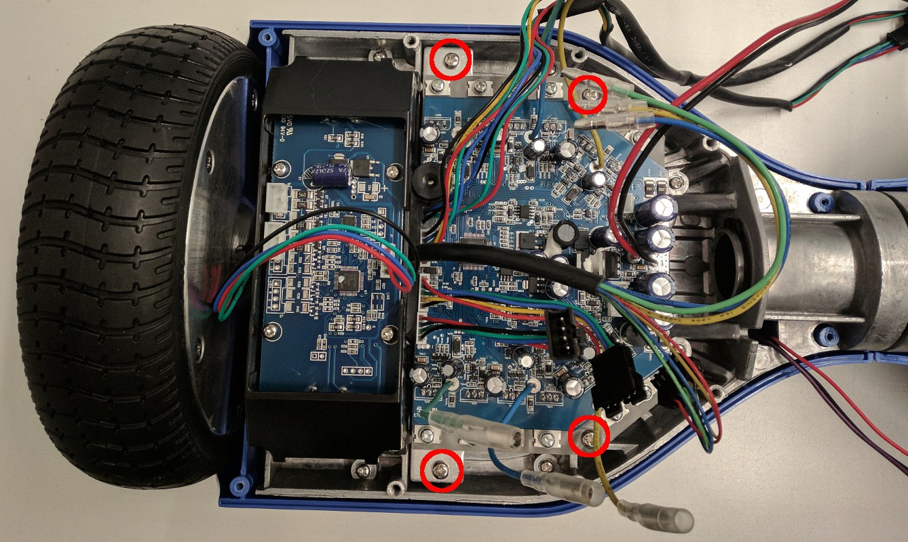

## Разбор гироскутера

* Отвинтить болты отверткой PH2

* Отвинтить болты отверткой PH2. Снять контроллер 

* Снять боковые платы отверткой PH2  
* Болты колес откручиваются HEX 6mm  

Снять кнопки пуска и разъем зарядки

Вот то, что нужно будет для сборки робота :

* 
* 
* 
* 

