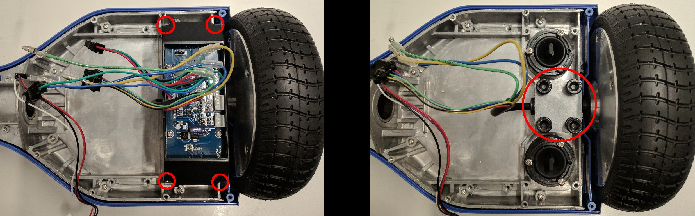

## Разбор гироскутера
Необходимо вывинтить болты отверткой PH2

Снять контроллер отверткой PH2

Снять боковые платы отверткой PH2  
Болты колес откручиваются HEX 6mm  

Вот то, что нужно будет для сборки робота :

