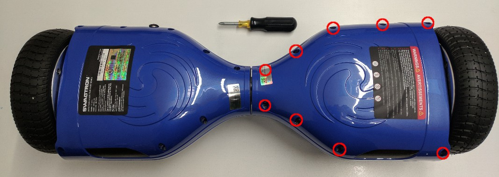
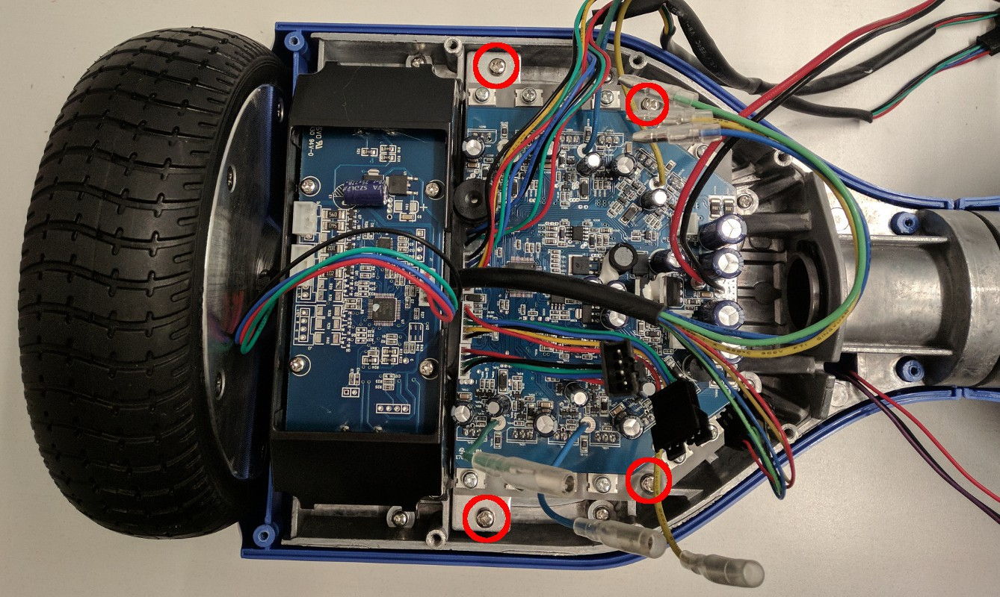
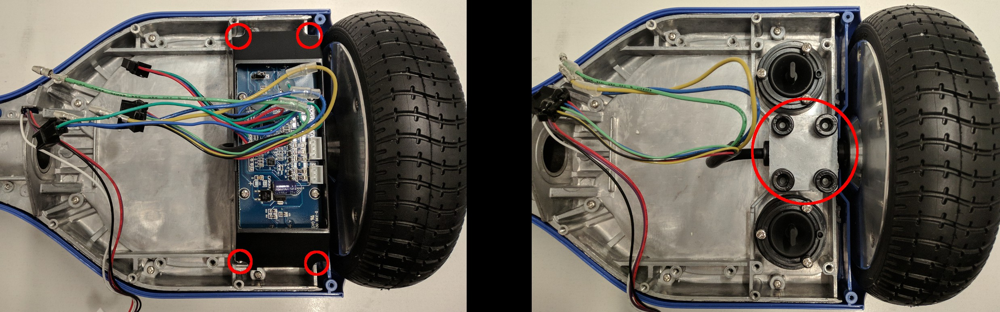
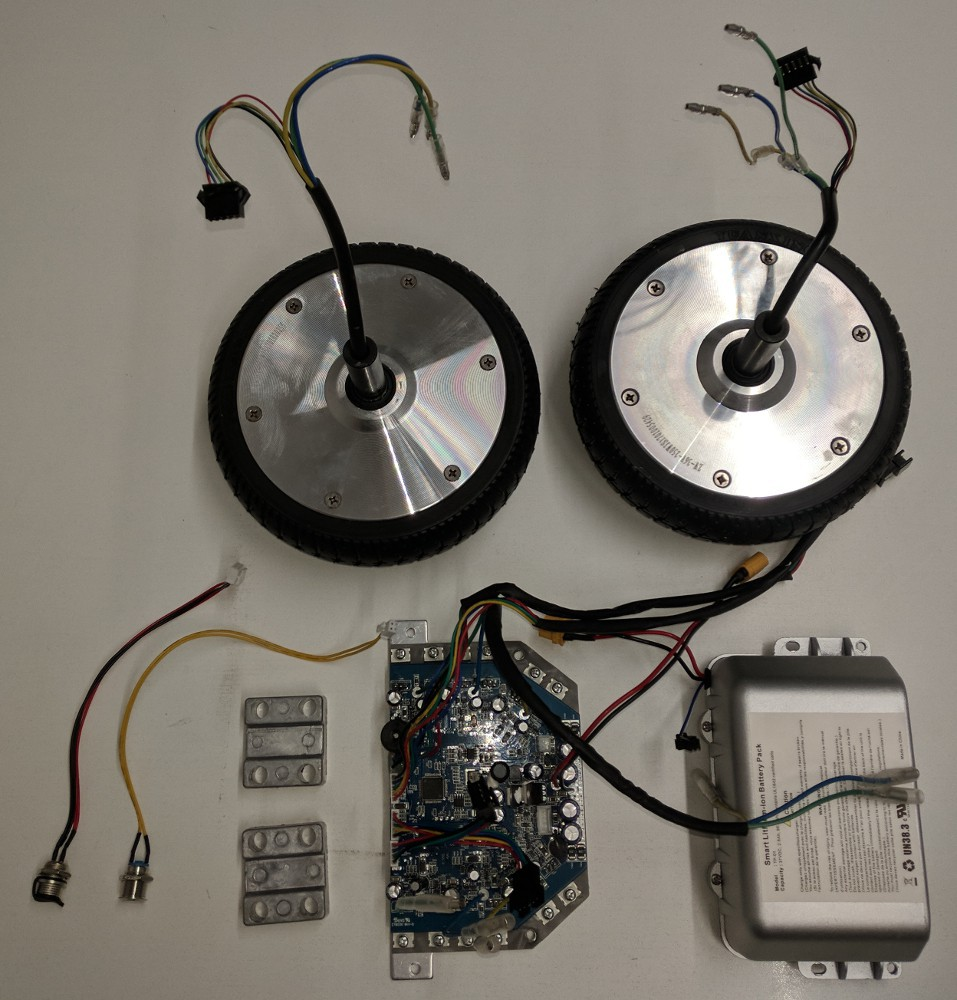
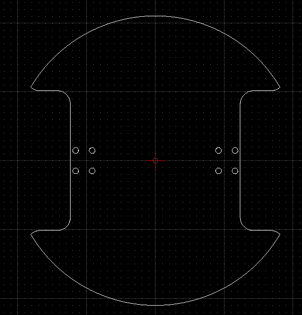
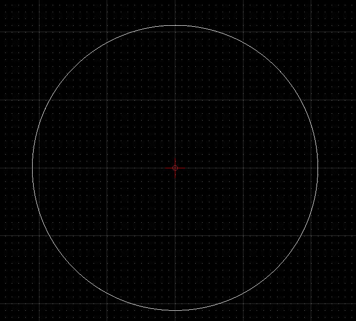
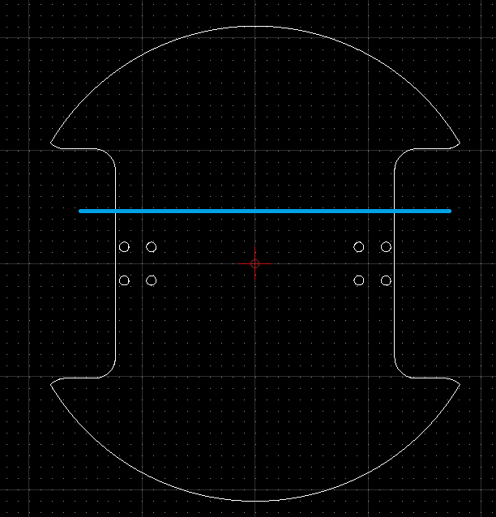

# Робот из гироскутера

## 1. Разбор гироскутера
Необходимо вывинтить болты отверткой PH2

Далее снять контроллер отверткой PH2

Далее снять боковые платы отверткой PH2
Болты колес откручиваются HEX 6mm 

Вот то, что нужно будет для сборки робота :

## 2. Подготовка платформы

### 2.1 Заготовка деталей
Необходимо вырезать из фанеры 4мм лобзиком, либо на станке :

3 детали 

[Чертеж низа](./drawings/base_template.dxf)

2 детали по следующим чертежам

[Чертеж верха](./drawings/base_top.dxf)

Детали склеиваются по двое столярным ПВА клеем

[PIC]

Кроме этого понадобится брус 40х40 достаточной длины, что бы отпилить :

2 бруска по 125 мм
2 бруска по 110 мм
2 бруска по 75 мм

### 2.2 Сборка низа

Используюя 8 болтов М8х40 и крепежные пластины от гироскутера, устанавливаем колеса

[PIC]

Размечаем центральную линию и ставим колеса :

Подбор колес простой - высота от крепежа до точки касани должна быть 60 мм.
Более подробно тут :

По намеченным точкам - высверлливаем отверстия и ставим колеса на болты M4x20, 
обязательно прокладывая шайбами место установки

2 бруска по 125 мм устанавливаются вдоль ниш колес и проклеиваются столярным ПВА клеем

[pic]

2 бруска по 110 мм устанавливаются на дальней стороне и проклеиваются столярным ПВА клеем 

[pic]

Между брусками устанавливается контроллер

[pic]

Соединяются провода

[pic]

### 2.2 Установка батареи
Батарея устанавливается в держатель на болты М4х40 ??
[PIC]

Модель держателя взята отсюда : [M365 extra battery from hoverboard](https://www.thingiverse.com/thing:4254412)
 и перевыложена локально : [STL файл держателя батареи](./STL/BatteryHolder.stl)

### 2.2 Установка крышки отсека

Оставшаяся деталь низа опиливается по синей линии

Используя крепления для мебели все крепится на бруски

[pic]

### 2.2 Установка крышки робота

После того как все подогнано - шурупами закрепляются 2 бруска по 125 мм и 2 бруска по 110 мм

На бруски 110 мм устанавливаются петли, на 
